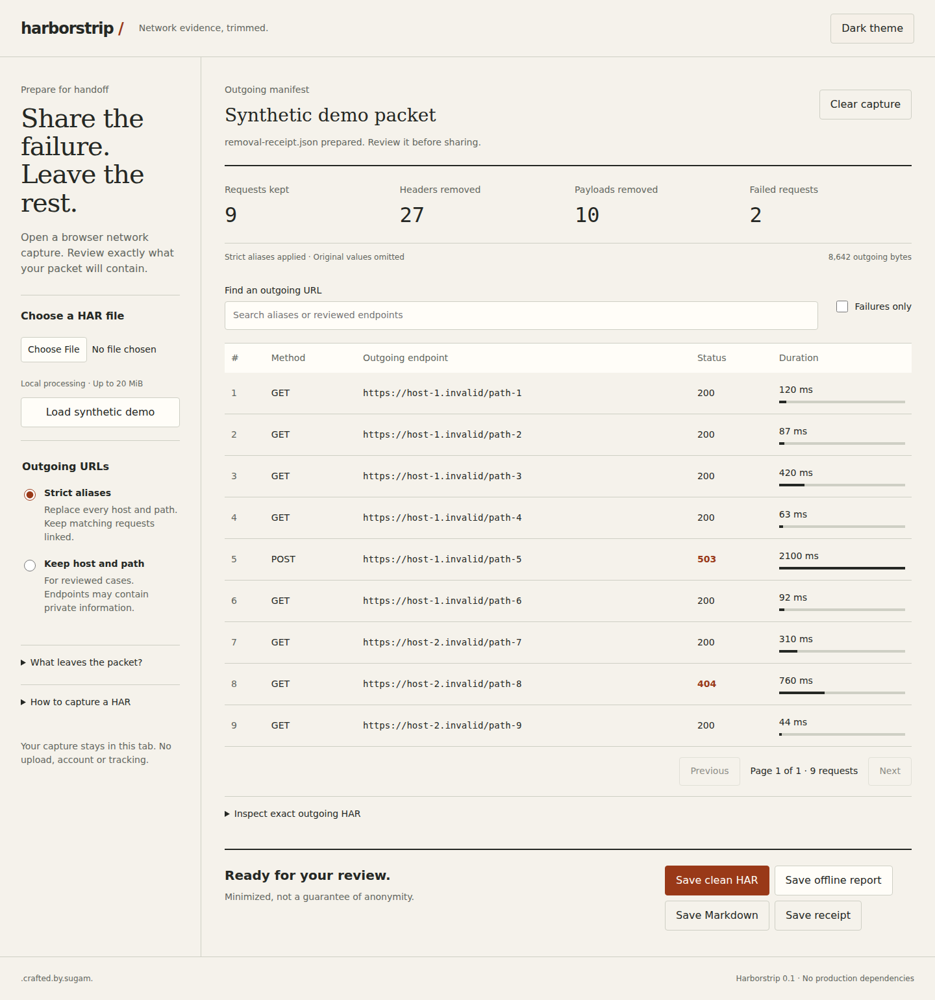

# harborstrip /

**Share the network failure. Leave captured secrets behind.**

A local browser tool and Node CLI that reconstructs a minimal HAR packet, with strict URL aliases, an exact outgoing preview, a removal receipt and an offline report.



```sh
npm ci --ignore-scripts && npm run build && npm run dev
```

Open http://localhost:4173 and load the labelled synthetic demo. [Hosted demo](https://harborstrip.vercel.app/).

## Why it exists

HAR captures can contain session cookies, credentials and private payloads. Existing sanitizers already help. Harborstrip takes a stricter approach: rebuild from a small set of known fields, with optional strict aliases, so arbitrary custom data cannot ride along. It deliberately sacrifices context. [Research and limits](docs/research/FINAL_IDEA.md).

## What works

- Open a HAR locally, up to 20 MiB / 10,000 requests.
- Remove captured headers, cookies, bodies, query strings, fragments, real capture dates, page titles, IPs and extra fields.
- Keep request order, method, status, relative timing and sizes.
- Alias all hosts/paths consistently, or explicitly retain reviewed HTTP(S) endpoints.
- Search requests, filter failures, paginate and inspect outgoing JSON.
- Save clean HAR, JSON receipt, Markdown or a script-free offline HTML report.
- Switch light/dark themes. No accounts, production libraries, storage, AI or analytics.

**Minimization is not anonymity.** Timing and size still reveal behavior. Endpoint mode may retain private identifiers in hosts/paths. Review before sharing. Do not use output as a replay fixture: bodies and headers are gone.

## CLI

Node 22 or newer. No dependencies needed for CLI:

```sh
node scripts/cli.js input.har clean.har
node scripts/cli.js input.har packet.html --html
node scripts/cli.js input.har packet.md --markdown
node scripts/cli.js input.har receipt.json --receipt
node scripts/cli.js input.har reviewed.har --endpoints
```

Output refuses to overwrite existing files. Generic output filenames avoid leaking the original capture name. Package registry publication has not occurred, so no npx installation claim.

## Development and verification

```sh
npm ci --ignore-scripts
npm run lint
npm run typecheck
npm test
npm run build
npx playwright install chromium
npm run test:e2e
```

11 unit/CLI tests plus browser interaction tests cover canary removal, unknown fields, aliases, malformed inputs, reports, downloads, filters, themes, pagination and five responsive widths. See [TESTING](docs/TESTING.md) for the exact observed result. GitHub Actions runs these checks on pushes and pull requests. [CI status](https://github.com/Sugamdeol/harborstrip/actions).

## Structure and hosting

`src/core.js` is the privacy boundary. `public/app.js` handles controls. `scripts/cli.js` uses the same core. `scripts/build.js` copies it into the static output. Host `dist/` after building. Production runs on Vercel with automatic deployment from `main`. No `.env` values or API keys required. [Architecture](docs/ARCHITECTURE.md) · [Privacy](docs/PRIVACY.md) · [Deployment/cost](docs/DEPLOYMENT.md).

## Roadmap and contributing

Validate recipient usefulness first. Next experiments include selected-request packets, explicit header allowlists and a synthetic browser-capture corpus. These are proposals, not shipped features. [Roadmap](docs/ROADMAP.md) · [Contributing](CONTRIBUTING.md) · [Security](SECURITY.md).

## License

MIT. .crafted.by.sugam.
